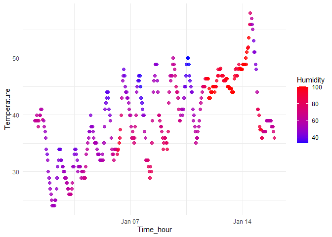

p8105_hw1_bz2570
================
Boran Zhai
2025-09-18

## Problem 1

#### Load the library and the data

``` r
library(moderndive)
library(tidyverse)
```

    ## ── Attaching core tidyverse packages ──────────────────────── tidyverse 2.0.0 ──
    ## ✔ dplyr     1.1.4     ✔ readr     2.1.5
    ## ✔ forcats   1.0.0     ✔ stringr   1.5.1
    ## ✔ ggplot2   3.5.2     ✔ tibble    3.3.0
    ## ✔ lubridate 1.9.4     ✔ tidyr     1.3.1
    ## ✔ purrr     1.1.0     
    ## ── Conflicts ────────────────────────────────────────── tidyverse_conflicts() ──
    ## ✖ dplyr::filter() masks stats::filter()
    ## ✖ dplyr::lag()    masks stats::lag()
    ## ℹ Use the conflicted package (<http://conflicted.r-lib.org/>) to force all conflicts to become errors

``` r
library(ggplot2)
```

``` r
data("early_january_weather")
```

#### Write a short description of the dataset

``` r
vars <- names(early_january_weather)
n_rows = nrow(early_january_weather)
n_cols = ncol(early_january_weather)
temp_mean = mean(early_january_weather$temp)
summary(early_january_weather)
```

    ##     origin               year          month        day              hour      
    ##  Length:358         Min.   :2013   Min.   :1   Min.   : 1.000   Min.   : 0.00  
    ##  Class :character   1st Qu.:2013   1st Qu.:1   1st Qu.: 4.000   1st Qu.: 6.00  
    ##  Mode  :character   Median :2013   Median :1   Median : 8.000   Median :11.50  
    ##                     Mean   :2013   Mean   :1   Mean   : 8.039   Mean   :11.53  
    ##                     3rd Qu.:2013   3rd Qu.:1   3rd Qu.:12.000   3rd Qu.:17.75  
    ##                     Max.   :2013   Max.   :1   Max.   :15.000   Max.   :23.00  
    ##                                                                                
    ##       temp            dewp           humid           wind_dir    
    ##  Min.   :24.08   Min.   : 8.96   Min.   : 32.86   Min.   :  0.0  
    ##  1st Qu.:33.98   1st Qu.:19.94   1st Qu.: 51.34   1st Qu.:140.0  
    ##  Median :39.02   Median :26.06   Median : 61.67   Median :240.0  
    ##  Mean   :39.58   Mean   :28.06   Mean   : 65.48   Mean   :208.2  
    ##  3rd Qu.:44.96   3rd Qu.:35.06   3rd Qu.: 78.68   3rd Qu.:290.0  
    ##  Max.   :57.92   Max.   :53.06   Max.   :100.00   Max.   :360.0  
    ##                                                   NA's   :5      
    ##    wind_speed       wind_gust         precip            pressure   
    ##  Min.   : 0.000   Min.   :16.11   Min.   :0.000000   Min.   :1011  
    ##  1st Qu.: 5.754   1st Qu.:19.56   1st Qu.:0.000000   1st Qu.:1018  
    ##  Median : 8.055   Median :21.86   Median :0.000000   Median :1022  
    ##  Mean   : 8.226   Mean   :22.53   Mean   :0.002039   Mean   :1023  
    ##  3rd Qu.:11.508   3rd Qu.:25.32   3rd Qu.:0.000000   3rd Qu.:1027  
    ##  Max.   :24.166   Max.   :31.07   Max.   :0.190000   Max.   :1034  
    ##                   NA's   :308                        NA's   :38    
    ##      visib          time_hour                  
    ##  Min.   : 0.120   Min.   :2013-01-01 01:00:00  
    ##  1st Qu.: 9.000   1st Qu.:2013-01-04 19:15:00  
    ##  Median :10.000   Median :2013-01-08 12:30:00  
    ##  Mean   : 8.515   Mean   :2013-01-08 12:28:09  
    ##  3rd Qu.:10.000   3rd Qu.:2013-01-12 05:45:00  
    ##  Max.   :10.000   Max.   :2013-01-15 23:00:00  
    ## 

``` r
cat(" names:",vars,"\n",
    "size:",n_rows,"rows","and",n_cols,"columns","\n",
    "the mean temperature:", temp_mean)
```

    ##  names: origin year month day hour temp dewp humid wind_dir wind_speed wind_gust precip pressure visib time_hour 
    ##  size: 358 rows and 15 columns 
    ##  the mean temperature: 39.58212

##### Description

The dataset early_january_weather contains 358 rows and 15 columns, with
the following variables and some values of important variables: origin,
year(2013), month(January), day(from 1-15), hour, temp(ranges from 24.08
to 57.92 with a mean of about 39.58), dewp(ranges from 8.96 to 53.06
with a mean of about 28.06), humid(ranges from 32.86 to 100.00 with a
mean of about 65.48), wind_dir, wind_speed, wind_gust, precip,
pressure(ranges from 1011 to 1034 with mean of about 1023), visib(ranges
from 0.12 to 10.00 with mean near 8.52), and time_hour(falls between
2013-01-01 01:00:00 to 2013-01-15 23:00:00). <br/>

The mean temperature is approximately 39.58.

#### Make a scatterplot of temp (y) vs time_hour (x); color points using the humid variable

``` r
Sys.setlocale("LC_TIME","English")
```

    ## [1] "English_United States.1252"

``` r
scatterplot <- ggplot(early_january_weather, aes(x = time_hour, y = temp, color = humid)) +
  geom_point(size = 2, alpha = 0.8) +        
  scale_color_gradient(low = "blue", high = "red") + 
  labs(x = "Time_hour", y = "Temperature", color = "Humidity") +
  theme_minimal()
print(scatterplot)
```

<!-- -->

``` r
ggsave(
  filename = "D:/zbr/p8105_hw1_bz2570/scatterplot.png", 
  plot = scatterplot
)
```

    ## Saving 7 x 5 in image

##### Description

The scatter plot illustrates the relationship between
temperature(y-axis) and time_hour(x-axis) for the early January.It shows
a moderate overall rise of temperature from January 1st to 15th, with
daily minimum and maximum temperatures gradually increasing. This
pattern was temporarily broken by two anomalous periods around January
7th-8th and January 15th. Besides, daily temperatures follow a regular
and wave-like pattern. Within each day, lower temperatures usually occur
overnight and in the early morning, while higher temperatures are
observed during midday and afternoon hours. Additionally, each point
colored according to the humidity level, using a blue-to-red gradient
where blue represents low humidity and red represents high humidity.
However, there is an inverse relationship between temperature and
humidity: warmer times always have lower humidity(blue) and colder times
have higher humidity(red).

## Problem 2

#### Create a data frame

``` r
set.seed(917)
df <- data.frame(
  random_sample = rnorm(10),
  logical_vector = rnorm(10) > 0,
  char_vector = letters[1:10], 
  factor_vector = factor(rep(c("Small", "Medium", "Large"), length.out = 10)) 
)
str(df)
```

    ## 'data.frame':    10 obs. of  4 variables:
    ##  $ random_sample : num  1.051 -0.787 1.219 -0.202 0.622 ...
    ##  $ logical_vector: logi  FALSE TRUE FALSE FALSE FALSE TRUE ...
    ##  $ char_vector   : chr  "a" "b" "c" "d" ...
    ##  $ factor_vector : Factor w/ 3 levels "Large","Medium",..: 3 2 1 3 2 1 3 2 1 3

#### Try to take the mean of each variable and explain

``` r
mean_random <- mean(pull(df, random_sample))
mean_logical <- mean(pull(df, logical_vector))
mean_char <- mean(pull(df, char_vector))
```

    ## Warning in mean.default(pull(df, char_vector)): argument is not numeric or
    ## logical: returning NA

``` r
mean_factor <- mean(pull(df, factor_vector))
```

    ## Warning in mean.default(pull(df, factor_vector)): argument is not numeric or
    ## logical: returning NA

``` r
cat(" The mean of random sample is",mean_random,"\n",
    "The mean of logical vector is",mean_logical,"\n",
    "The mean of character vector  is",mean_char,"\n",
    "The mean of factor vector is",mean_factor
)
```

    ##  The mean of random sample is 0.006486035 
    ##  The mean of logical vector is 0.4 
    ##  The mean of character vector  is NA 
    ##  The mean of factor vector is NA
