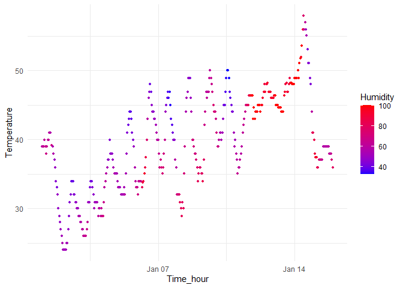

p8105_hw1_bz2570
================
Boran Zhai
2025-09-18

## Problem 1

#### Load the library and the data

``` r
library(moderndive)
library(tidyverse)
```

    ## ── Attaching core tidyverse packages ──────────────────────── tidyverse 2.0.0 ──
    ## ✔ dplyr     1.1.4     ✔ readr     2.1.5
    ## ✔ forcats   1.0.0     ✔ stringr   1.5.1
    ## ✔ ggplot2   3.5.2     ✔ tibble    3.3.0
    ## ✔ lubridate 1.9.4     ✔ tidyr     1.3.1
    ## ✔ purrr     1.1.0     
    ## ── Conflicts ────────────────────────────────────────── tidyverse_conflicts() ──
    ## ✖ dplyr::filter() masks stats::filter()
    ## ✖ dplyr::lag()    masks stats::lag()
    ## ℹ Use the conflicted package (<http://conflicted.r-lib.org/>) to force all conflicts to become errors

``` r
library(ggplot2)
data("early_january_weather")
```

#### Write a short description of the dataset (inline R code)

The dataset early_january_weather contains 358 rows and 15 columns, with
the following variables: origin, year, month, day, hour, temp, dewp,
humid, wind_dir, wind_speed, wind_gust, precip, pressure, visib,
time_hour. <br/> For some key variables:<br/> Temperature(temp): range
from 24.08 to 57.92 with an approximate mean of 39.58;<br/>
Humidity(humid): range from 32.86 to 100 with an approximate mean of
65.48;<br/> Wind speed(wind_speed): ranges from 0 to 24.16638 with an
approximate mean of 8.23;<br/> Time_hour: falls between 2013-01-01
01:00:00 to 2013-01-15 23:00:00.

#### Make a scatterplot of temp (y) vs time_hour (x); color points using the humid variable

``` r
Sys.setlocale("LC_TIME","English")
```

    ## [1] "English_United States.1252"

``` r
scatterplot <- ggplot(early_january_weather, aes(x = time_hour, y = temp, color = humid)) +
  geom_point(size = 1) +        
  scale_color_gradient(low = "blue", high = "red") + 
  labs(x = "Time_hour", y = "Temperature", color = "Humidity") +
  theme_minimal()
print(scatterplot)
```

<!-- -->

``` r
ggsave(
  filename = "D:/zbr/p8105_hw1_bz2570/scatterplot.png", 
  plot = scatterplot
)
```

    ## Saving 7 x 5 in image

##### Description

The scatter plot illustrates the relationship between
temperature(y-axis) and time_hour(x-axis) for the early January.It shows
a moderate overall rise of temperature from January 1st to 15th, with
daily minimum and maximum temperatures gradually increasing. This
pattern was temporarily broken by two anomalous periods around January
7th-8th and January 15th. Besides, daily temperatures followed a regular
and wave-like pattern. Within each day, lower temperatures usually
occured overnight and in the early morning, while higher temperatures
were observed during midday and afternoon hours. Additionally, each
point colored according to the humidity level, using a blue-to-red
gradient where blue represents low humidity and red represents high
humidity. However, there was an inverse relationship between temperature
and humidity: warmer times always had lower humidity(blue) and colder
times had higher humidity(red).

## Problem 2

#### Create a data frame

``` r
set.seed(917)
df <- data.frame(
  random_sample = rnorm(10),
  logical_vector = rnorm(10) > 0,
  char_vector = letters[1:10], 
  factor_vector = factor(rep(c("Small", "Medium", "Large"), length.out = 10)) 
)
str(df)
```

    ## 'data.frame':    10 obs. of  4 variables:
    ##  $ random_sample : num  1.051 -0.787 1.219 -0.202 0.622 ...
    ##  $ logical_vector: logi  FALSE TRUE FALSE FALSE FALSE TRUE ...
    ##  $ char_vector   : chr  "a" "b" "c" "d" ...
    ##  $ factor_vector : Factor w/ 3 levels "Large","Medium",..: 3 2 1 3 2 1 3 2 1 3

#### Try to take the mean of each variable and explain

``` r
mean_random <- mean(pull(df, random_sample))
mean_logical <- mean(pull(df, logical_vector))
mean_char <- mean(pull(df, char_vector))
```

    ## Warning in mean.default(pull(df, char_vector)): argument is not numeric or
    ## logical: returning NA

``` r
mean_factor <- mean(pull(df, factor_vector))
```

    ## Warning in mean.default(pull(df, factor_vector)): argument is not numeric or
    ## logical: returning NA

``` r
cat(" The mean of random sample is",mean_random,"\n",
    "The mean of logical vector is",mean_logical,"\n",
    "The mean of character vector  is",mean_char,"\n",
    "The mean of factor vector is",mean_factor
)
```

    ##  The mean of random sample is 0.006486035 
    ##  The mean of logical vector is 0.4 
    ##  The mean of character vector  is NA 
    ##  The mean of factor vector is NA

##### Description

Taking the mean works on numeric(random_stample) and logical variable
(logical_vector) because logical vectors are automatically converted to
numbers (TRUE = 1, FALSE = 0). However, it doesn’t work on character
(char_vector) and factor (factor_vector) variables, which generate NA
with a warning.<br/>

#### Applies the as.numeric function

logical_as_numeric \<- as.numeric(pull(df, logical_vector)) <br/>
char_as_numeric \<- as.numeric(pull(df, char_vector)) <br/>
factor_as_numeric \<- as.numeric(pull(df, factor_vector)) <br/>

After applying the as.numeric function, these vector will be
changed:<br/> *Logical vector convert to 1 (TRUE) or 0 (FALSE),so it
will have mean;<br/> *Character vector still returns NA with warning for
all values because letters cannot be interpreted as numbers, and it
won’t have mean;<br/> \*Factor vector return to integers corresponding
to factor levels,such as “1”“2”“3” for “Small”“Medium”“Large”, not the
original numeric values. So it will have mean, but mean is
meaningless.<br/>

#### Does this help explain what happens when you try to take the mean?

Yes, applying as.numeric() explains the behavior of the mean() function.
The mean calculation works for the numeric and logical vectors because
they can be directly or implicitly converted to meaningful numbers.
However, it doesn’t work on the character and factor vectors. For the
character vector, it always return NA because the text characters have
no numerical interpretation. While the factor vector can be converted to
numbers, these values represent the integer codes of its categories like
“1”,“2”,“3”and so on with no quantitative meaning. This confirms that
mean function requires numeric data and only automatically handles the
logical-to-numeric coercion.
